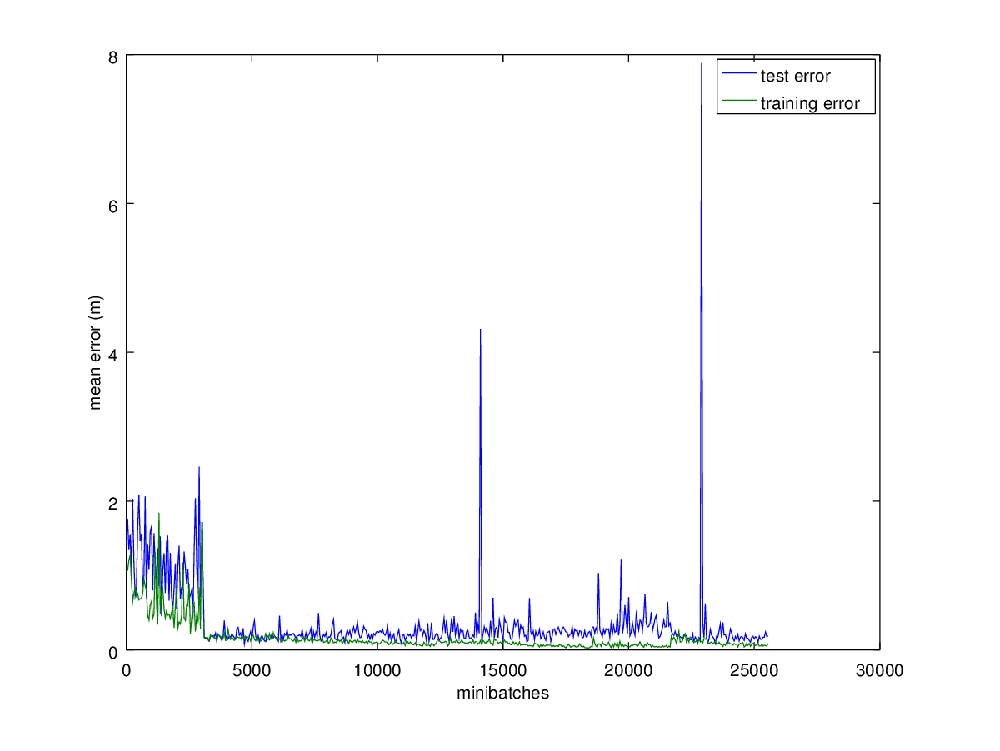

This is a PoC application for using Google TensorFlow and LSTM neural networks to learn
a generative neural network for multiple human location data.

This generated data can be used in simulation environments to simulate human behavior.

The goal is to take into account the spatial flow, temporal dynamics and cooperative group behavior.

Requirements
============

`sudo apt-get install python-numpy python-scipy python-matplotlib ipython ipython-notebook python-pandas python-sympy python-nose`

[https://www.tensorflow.org/versions/r0.7/get_started/os_setup.html#download-and-setup](https://www.tensorflow.org/versions/r0.7/get_started/os_setup.html#download-and-setup)

Dataset
=======

The dataset used is player location data from a soccer game.
The source for the dataset is https://datahub.io/dataset/magglingen2013, the game TR vs. FT.

The player 0 is the ball.

The first few moments of the game visualized: [https://youtu.be/TykeaEGmYI0](https://youtu.be/TykeaEGmYI0)

Run `./getData.sh` to get the dataset.

Run `./process.py` to parse the dataset and convert it into Octave format for inspection.

The coordinates x and y are limited by the soccer field size (assumption here): x = [-53, 53], y = [-35, 35].

You can plot the data in Octave using:

`load('tracks.mat')`

`p = 5;`

`indices = (abs(pos(:,p,1)) <= 53 & abs(pos(:,p,2)) <= 35); scatter(pos(indices,p,1), pos(indices,p,2), 2, p);`

Here 5 is the index of the player, and the first command filters out the empty and otherwise invalid values.

Screenshots of sample data
=========================

An example track:

The first 5 tracks:

Neural network structure and intuition
======================================

Diagram of the network structure consisting of a bank of identical LSTM modules:
The shared weights are shown in the same color. The self-input is on red with w1 label.

The neural network comprises of a bank of modules, each module estimating the next position of a particular
target. Exploiting the symmetries in the domain, all modules have identical weights.
The modules can be trained together, or one module can be trained by each target data in sequence.
Training only one module and cloning it for all the targets is convenient for the situations where the
number of targets is unknown.

The inputs (and internal states for RNNs) differ per module in the bank respecting the special position for the self-input
corresponding to the input for the target for which this module is predicting the next position.

These modules should be recurrent to have time dynamics in addition to trivial average flow in field space.

The weights should be forced equal so that each module is interchangeable so that:
 * The associated weights towards self-input are the same for all modules.
 * The associated weights towards inputs other than self are similar.

Therefore, the model of one target is used for all targets.
The model can learn coordination between targets, that is, formations and complex team dynamics,
because the modules get information of the positions of other targets as well.

LSTM modules will be used for this exercise.

The intuition behind layers is that the first LSTM layer models the trivial space-time domain kinematics
of the target, and relations to peers, and trivial flocking behavior, see Boids.
The second LSTM layer models the higher level coordination dynamics.

Trying simple things first, going towards more complex ideas to evaluate improvement. The number and type of layers will
change as a result of experiments later.

After experiments it seems that one LSTM layer is enough, and somewhat few neurons are needed (at least less than 16).

Output of TensorBoard of the network model is as follows:

Coding
======

The locations are coded as simple x and y floating point values, as in the original data.
Each player has a pair of input neurons corresponding to the current position, and the delta from the last position
before that for both coordinates x and y.

The value signifying missing values is replaced by a special on-off neuron. This neuron is off when either of the input
values is the placeholder value signifying missing data. When the neuron is off, both x and y neurons respectively are
zeroed.

Two peers are chosen randomly to the input.
For one module, that is 1 target and 2 peers, this makes 3 x (2 x 2 + 1) = 15 input neurons
for each module, of which 3 are on-off valued, and the rest are continuous valued.
The input data is the similar for each module, but the target to predict is shifted to the first neurons.

The output neuron coding is identical to the input neuron coding but only has the predicted next x and y position for
the target tracked by the module.

For these continuous valued outputs a distance loss function is used.

The enabled flag per module can be predicted also, with the loss function chosen accordingly (so that the predicted location
does not matter if the prediction is disabled, but so that the associated loss for incorrectly predicting the enabled
flag is high).

In generation mode the output can be fed back to the inputs by calculating the deltas. Optionally gaussian noise
can be added to the values before feeding them back to make the traces non-deterministic.

Results
=======

For the following parameters:

{'n_input': 12, 'learning_rate': 0.01, 'batch_size': 16, 'training_iters': 10000, 'lstm_layers': [16], 'n_steps': 5, 'n_output': 2, 'decay': 0.99995, 'input_layer': None, 'display_step': 10, 'n_targets': 23, 'n_peers': 2, 'lstm_clip': 10.0}

We get:

Some unexpected peaks are visible at some test set points. These can be due to weird data in the test sets, or due to
these regions not being represented in the training set. The source data is a bit sketchy, considering a significant portion
of it goes outside of the field and bounces around at a significant portion of the speed of light.

Both converge pretty fast to a value roughly corresponding the error of 0.2 m.

Example prediction after 4638 iterations, the blue is the track so far, the green shows the predicted position, and the red shows the real subsequent position:

The example is predicted from the test set, so is not in the training material, i.e. seen before by the system.
Not all predictions go as well, but the general error is below 0.2 m.

Generative Mode
===============

The generation is done by feeding positions of three peers one by one to the bank of three LSTMs, and iterating.
There is no limit on the number of LSTM modules to use, but there should be at least three, because the module
was trained with two peer targets.

With no random component included, the position generation is completely deterministic. Technically we could include
some noise to the sequence, to generate varying traces. This is mathematically valid if we interpret the output
of the LSTM to represent the expected value of some distribution. Other distribution parameters could be estimated
by testing the system against the test set data.

The first generation was run for predictions of position deltas, instead of absolute positions.
The results for the first test generation, for the model learned in one pretty successful run:

Parameters:
`delta = np.asarray([[0.0, 0.0], [0.0, 0.0], [0.0, 0.0]])`
`pos = np.asarray([[0.0, 0.0], [0.0, 0.3], [0.0, -0.3]])`

We see some coordination between the players, even if their starting positions differ a bit. Regardless they all run out
of the field, and once outside, the neural network has less opinions about where to run next, so they run together
to the horizon, much like dogs do.

It would seem the network cares too little about the general position on the field. This is evident from the fact
that the positions differ somewhat little from each other. Although for all fairness it should be noted that
in the training data also some players did run out of the field.

Running the network in a mode where it predicts the positions rather than deltas leads to a more bounded result, although
the tracks are not as clean. Test set error is quite high, i.e. the parameters have a high variance. Still needs some tuning.

A representative result given below:

Next, we will try predicting both the delta and the absolute position with the network.
With 2-layer LSTM network with somewhat tuned parameters, and a longer generation time (varied around the starting positions
a bit also):

`{'n_input': 12, 'learning_rate': 0.01, 'batch_size': 16, 'training_iters': 10000, 'lstm_layers': [6, 4], 'n_steps': 5, 'n_output': 4, 'decay': 0.99995, 'input_layer': None, 'display_step': 10, 'n_targets': 23, 'n_peers': 2, 'lstm_clip': 10.0}`

`delta = np.asarray([[0.15, 0.0], [0.0, -0.1], [-0.1, 0.1]])`

`pos = np.asarray([[0.0, 0.0], [0.1, 1.3], [10.1, -1.3]])`

The system overfits somewhat, but generates nice traces. The system seems to have an attractor at a specific
point, because all the players eventually run there and stop. This is not very surprising, as dynamic, deterministic
systems do that often. Even adding a moderate amount of noise leads to the same general pattern, so we see it is about
overfitting. Parameters need to be tuned more.

Same as a video (shortened a bit, because the end does not change): [https://youtu.be/lmNsdmsUtwI](https://youtu.be/lmNsdmsUtwI)

Disclaimer / Warning
====================

Do not use these networks for guiding real soccer robots. They will most likely escape and run away.

Ideas and Notions
=================

 * Another neural network module could be used to predict spawning of new targets. The current data set does not have
   such effects, though.
 * Using only the tracked target plus two others selected randomly, because the peer targets are symmetric and
   do not bring relevant new information.
 * Predicting difference to the last position is more accurate than predicting absolute position, but
   it leads to the predicted position error accumulation so that the player drifts out of the field.

Open Issues
===========

Everything fixed.

Copyright / License
===================
Copyright: Tero Keski-Valkama (2016)
License: WTFPL, http://www.wtfpl.net/
