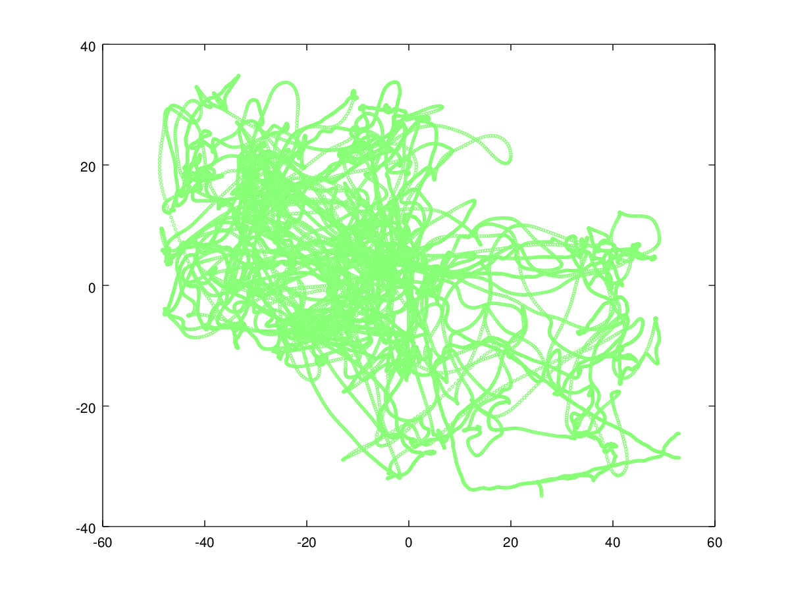

This is a PoC application for using Google TensorFlow and LSTM neural networks to learn
a generative neural network for multiple human location data.

This generated data can be used in simulation environments to simulate human behavior.

The goal is to take into account the spatial flow, temporal dynamics and cooperative group behavior.

The dataset used is player location data from a soccer game.
The source for the dataset is https://datahub.io/dataset/magglingen2013, the game TR vs. FT.

Run `./getData.sh` to get the dataset.

Run `./process.py` to parse the dataset and convert it into Octave format for inspection.

You can plot the data in Octave using:

`tracks`

`p = 5;`

`indices = (max(pos(p,:,1),pos(p,:,2)) < 999); scatter(pos(p,indices,1), pos(p,indices,2));`

Here 5 is the index of the player, and the first command filters out the empty values.

Screenshot of sample data
=========================

Neural network structure and intuition
======================================

The neural network should comprise of modules, each estimating the next position of a particular
target.

These modules should be recurrent to have time dynamics in addition to trivial average flow in field space.

The weights should be forced equal so that each module is interchangeable so that:
 * The associated weights towards self-input are the same for all modules.
 * The associated weights towards inputs other than self are identical.

Therefore, all modules learn what one module sees, so the model of one target is used for all targets.
The model can learn coordination between targets, that is, formations and complex team dynamics,
because the modules get information of the positions of other targets as well.

LSTM modules with specially shared weights will be used for this exercise.
